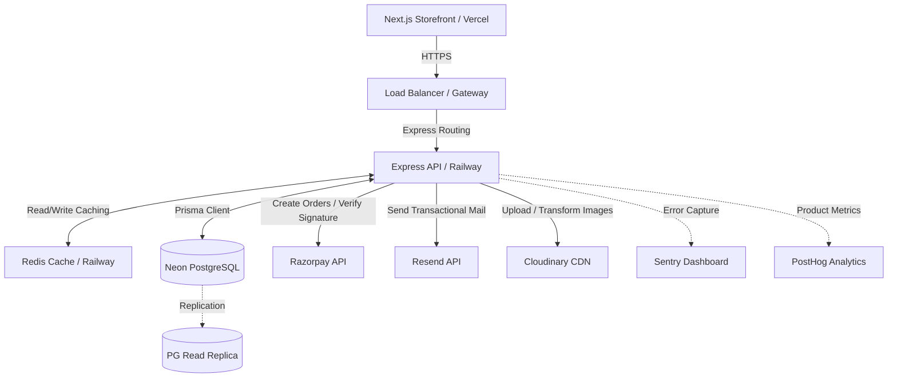
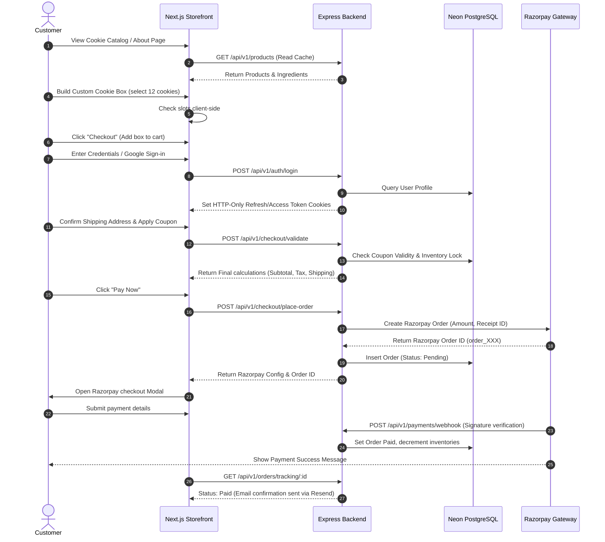

# LOAVIA Storefront: Backend Architecture Design Blueprint

This document specifies the complete, production-grade backend architecture for the **LOAVIA** storefront—a premium direct-to-consumer (D2C) millet cookie and gifting platform. It serves as the master blueprint for backend development teams.

---

## SECTION 1: Executive Summary

### System Goals
The LOAVIA backend is designed to provide a secure, fast, and scalable API platform. The key target metrics are:
- **Latencies:** sub-50ms API response times for read operations under typical loads.
- **Availability:** 99.99% uptime target.
- **Data Integrity:** Strict ACID compliance for checkout transactions and inventory controls.

### Business Objectives
The backend architecture is structured to support:
1. **D2C Storefront Operations:** Secure authentication, catalogs, cart state preservation, and order placement.
2. **Build Your Own Cookie Box (BYOB):** Dynamic slots validation, pricing adjustments, and inventory tracking for customized cookie assortments.
3. **Corporate and Personal Gifting:** Gift wrapping options, personalized message attachment, greeting card selection, and multi-recipient tracking.
4. **Operations and Management:** Complete inventory controls, analytics reporting, and order status transitions.

### Architectural Philosophy
We adopt a **modular monolith** approach built with **Node.js, Express, and TypeScript**. By strictly separation of concerns through a Model-Controller-Service-Repository design pattern, the system can scale as a single unit while allowing clear migration paths to microservices for high-load segments (such as the payment processing and inventory services) in the future.

### Scalability Approach
- **State Isolation:** The backend is completely stateless, relying on JWTs and session databases, enabling horizontal scaling using Railway container instances.
- **Caching Layer:** High-traffic read operations (like home screen metadata and product details) are cached in Redis to offload the Neon PostgreSQL database.
- **Database Scaling:** PostgreSQL queries are managed via Prisma ORM with connection pooling, utilizing index-optimized structures and transactional locks for critical operations.

### Security Approach
- **Layered Security:** Implementation of CORS controls, Helmet security headers, Express Rate Limiter, and strict JSON schema input validations.
- **Data Protection:** Access and refresh tokens stored in HTTP-Only cookies to mitigate XSS and CSRF hazards. 
- **Payment Compliance:** Razorpay integrations managed through cryptographically verified server-side webhook signatures, ensuring no client-tampered prices.

---

## SECTION 2: System Architecture Overview

### High Level Architecture

The following diagram illustrates the interactions between the storefront client, api gateways, databases, cache layers, and external APIs:



### Request Lifecycle

```
[Storefront Client]
       │
       ▼ (HTTPS POST /api/v1/orders)
┌──────────────────────────────────────────────┐
│ API Gateway / Express App                    │
│  ├─ Rate Limiter (express-rate-limit)        │
│  ├─ Security Headers (Helmet)                │
│  └─ CORS Check                               │
└──────────────────────┬───────────────────────┘
                       │ (Valid Request)
                       ▼
┌──────────────────────────────────────────────┐
│ Authentication Middleware                    │
│  ├─ Read HTTP-Only Cookie (AccessToken)      │
│  ├─ JWT Signature Validation                 │
│  └─ Populate req.user                        │
└──────────────────────┬───────────────────────┘
                       │ (Authenticated)
                       ▼
┌──────────────────────────────────────────────┐
│ Validator Middleware (Zod Schema Validation)  │
│  ├─ Check Payload Types                      │
│  └─ Sanitize Inputs                          │
└──────────────────────┬───────────────────────┘
                       │ (Valid Payload)
                       ▼
┌──────────────────────────────────────────────┐
│ Controller Layer (OrderController)           │
│  └─ Route request and map response codes      │
└──────────────────────┬───────────────────────┘
                       │
                       ▼
┌──────────────────────────────────────────────┐
│ Service Layer (OrderService)                 │
│  ├─ Fetch inventories & lock rows            │
│  ├─ Apply validation on custom box items     │
│  ├─ Calculate discounts & tax                │
│  └─ Call Razorpay SDK to create Order ID     │
└──────────────────────┬───────────────────────┘
                       │ (Begin Transaction)
                       ▼
┌──────────────────────────────────────────────┐
│ Repository Layer (OrderRepository)           │
│  └─ Execute Prisma Write (PG db transaction) │
└──────────────────────┬───────────────────────┘
                       │ (Success)
                       ▼
┌──────────────────────────────────────────────┐
│ Notification Services                        │
│  └─ Trigger Resend Mailer (Async queue)      │
└──────────────────────┬───────────────────────┘
                       │
                       ▼ (JSON 201 Created)
[Storefront Client] (Initiate checkout modal)
```

---

## SECTION 3: User Roles and Permissions

The system enforces Role-Based Access Control (RBAC). The following matrix defines endpoint groups and corresponding permissions:

| Permission / Action | Guest | Customer | Staff (Future) | Admin | Super Admin |
| :--- | :---: | :---: | :---: | :---: | :---: |
| Browse Products / Categories | ✓ | ✓ | ✓ | ✓ | ✓ |
| Manage Own Cart / Wishlist | ✓ | ✓ | ✓ | ✓ | ✓ |
| Place Order / Process Checkout | ✓ | ✓ | ✗ | ✗ | ✗ |
| Update Profile / Addresses | ✗ | ✓ | ✗ | ✓ | ✓ |
| Submit Review | ✗ | ✓ | ✗ | ✗ | ✗ |
| Moderate Reviews | ✗ | ✗ | ✓ | ✓ | ✓ |
| Manage Products / Stock Levels | ✗ | ✗ | ✓ | ✓ | ✓ |
| View Sales Analytics / Reports | ✗ | ✗ | ✗ | ✓ | ✓ |
| Create Coupons / Promo Codes | ✗ | ✗ | ✗ | ✓ | ✓ |
| Edit System Configurations | ✗ | ✗ | ✗ | ✗ | ✓ |
| Manage Admin/Staff Accounts | ✗ | ✗ | ✗ | ✗ | ✓ |

### Role Definitions
1. **Guest:** Unauthenticated session. Access is limited to read-only endpoints (catalog) and local storage cart utilities.
2. **Customer:** Authenticated user account. Full access to personal dashboard, order management, profile edits, and loyalty profiles.
3. **Staff:** Internal operational account. Access is limited to inventory reconciliation, order shipment status transitions, and review moderation.
4. **Admin:** Managerial account. Access to product CRUD, coupon creations, sales report dashboards, and CRM profiles.
5. **Super Admin:** Master platform account. Access to user role updates, connection parameters modifications, and system-wide audit trail logs.

---

## SECTION 4: Customer Journey Workflow



---

## SECTION 5: Admin Journey Workflow

### Product Creation & Stock Hydration
1. **Log in:** Admin logs into `/admin` using MFA credentials.
2. **Details Input:** Enters product details: Name, price, Dutch-cocoa description, calorie lists, and tags (e.g. `Millet`, `Gluten-Free`).
3. **Image Upload:** Uploads premium cookie photos. The controller sends files to Cloudinary, receiving optimized CDN image URLs.
4. **Database Record:** Backend performs a transaction creating the product, variants, and stock balances in table records.

### Order Fulfillment Cycle
1. **Notifications:** Orders flagged as `Paid` via Razorpay webhooks trigger dashboard updates.
2. **Packing Queue:** Warehouse staff pulls packaging slips. Staff transitions status to `Processing` then `Packed`.
3. **Shipment Dispatch:** Shipped parcel triggers updates where Staff attaches courier tracking URLs (e.g. BlueDart), transitioning order state to `Shipped`.
4. **Delivery Loop:** Delivery signals webhook status transition to `Delivered`.

---

## SECTION 6: Database Design (PostgreSQL)

Here is the details for the core database schemas, constraints, and optimization indexes:

### 1. `users` Table
Stores authentication and profile records.
- **Fields:**
  - `id`: `UUID` (Primary Key, Default: `gen_random_uuid()`)
  - `name`: `VARCHAR(100)` (Not Null)
  - `email`: `VARCHAR(255)` (Unique, Index, Not Null)
  - `password_hash`: `VARCHAR(255)` (Null if OAuth user)
  - `phone`: `VARCHAR(20)` (Null)
  - `role`: `VARCHAR(20)` (Default: `'CUSTOMER'`, Not Null)
  - `is_verified`: `BOOLEAN` (Default: `false`, Not Null)
  - `created_at`: `TIMESTAMP` (Default: `now()`, Not Null)
  - `updated_at`: `TIMESTAMP` (Default: `now()`, Not Null)
- **Indexes:**
  - Unique Index on `email`

### 2. `addresses` Table
Stores customer physical shipment endpoints.
- **Fields:**
  - `id`: `UUID` (Primary Key, Default: `gen_random_uuid()`)
  - `user_id`: `UUID` (Foreign Key -> `users.id` ON DELETE CASCADE)
  - `label`: `VARCHAR(50)` (e.g. `'Home'`, `'Office'`, Default: `'Home'`)
  - `recipient_name`: `VARCHAR(100)` (Not Null)
  - `street`: `TEXT` (Not Null)
  - `city`: `VARCHAR(100)` (Not Null)
  - `state`: `VARCHAR(100)` (Not Null)
  - `postal_code`: `VARCHAR(20)` (Not Null)
  - `country`: `VARCHAR(100)` (Default: `'India'`, Not Null)
  - `phone`: `VARCHAR(20)` (Not Null)
  - `is_default`: `BOOLEAN` (Default: `false`, Not Null)
- **Indexes:**
  - Index on `user_id`

### 3. `products` Table
Primary e-commerce catalog storage.
- **Fields:**
  - `id`: `UUID` (Primary Key, Default: `gen_random_uuid()`)
  - `name`: `VARCHAR(255)` (Not Null, Index)
  - `slug`: `VARCHAR(255)` (Unique, Index, Not Null)
  - `price`: `INT` (Price in Paise, e.g. 29900 for ₹299.00, Not Null)
  - `discount_price`: `INT` (Price in Paise, Null)
  - `description`: `TEXT` (Not Null)
  - `ingredients`: `TEXT` (Not Null)
  - `calories`: `VARCHAR(50)` (Null)
  - `in_stock`: `BOOLEAN` (Default: `true`, Not Null)
  - `is_popular`: `BOOLEAN` (Default: `false`, Not Null)
  - `is_featured`: `BOOLEAN` (Default: `false`, Not Null)
  - `featured_order`: `INT` (Null)
  - `created_at`: `TIMESTAMP` (Default: `now()`)
- **Indexes:**
  - Unique Index on `slug`
  - GIN Index on `name` (for search performance)

### 4. `product_images` Table
Saves asset endpoints.
- **Fields:**
  - `id`: `UUID` (Primary Key)
  - `product_id`: `UUID` (Foreign Key -> `products.id` ON DELETE CASCADE)
  - `url`: `TEXT` (Not Null)
  - `is_primary`: `BOOLEAN` (Default: `false`)

### 5. `inventories` Table
Tracks real-time stock balances to prevent overselling.
- **Fields:**
  - `id`: `UUID` (Primary Key)
  - `product_id`: `UUID` (Foreign Key -> `products.id` ON DELETE CASCADE, Unique)
  - `available_qty`: `INT` (Default: `0`, Not Null, Constraint: `available_qty >= 0`)
  - `reserved_qty`: `INT` (Default: `0`, Not Null)
  - `low_stock_threshold`: `INT` (Default: `10`, Not Null)

### 6. `orders` Table
Stores transaction records.
- **Fields:**
  - `id`: `UUID` (Primary Key)
  - `receipt_number`: `VARCHAR(100)` (Unique, Not Null)
  - `user_id`: `UUID` (Foreign Key -> `users.id` ON DELETE SET NULL)
  - `status`: `VARCHAR(50)` (Default: `'PENDING'`, Not Null)
  - `subtotal`: `INT` (Paise, Not Null)
  - `shipping_fee`: `INT` (Paise, Not Null)
  - `discount_amount`: `INT` (Paise, Default: 0)
  - `tax_amount`: `INT` (Paise, Not Null)
  - `total_amount`: `INT` (Paise, Not Null)
  - `shipping_address`: `JSONB` (Snapshotted address layout, Not Null)
  - `tracking_number`: `VARCHAR(100)` (Null)
  - `courier_partner`: `VARCHAR(100)` (Null)
  - `created_at`: `TIMESTAMP` (Default: `now()`)
- **Indexes:**
  - Index on `user_id`
  - Index on `receipt_number`

### 7. `order_items` Table
Details individual order contents.
- **Fields:**
  - `id`: `UUID` (Primary Key)
  - `order_id`: `UUID` (Foreign Key -> `orders.id` ON DELETE CASCADE)
  - `product_id`: `UUID` (Foreign Key -> `products.id` ON DELETE SET NULL)
  - `name`: `VARCHAR(255)` (Snapshot, Not Null)
  - `price`: `INT` (Paise, Snapshot, Not Null)
  - `quantity`: `INT` (Not Null)
  - `is_custom_box`: `BOOLEAN` (Default: `false`)
  - `custom_box_selections`: `JSONB` (Null, stores selections list if BYOB item)

### 8. `coupons` Table
- **Fields:**
  - `id`: `UUID` (Primary Key)
  - `code`: `VARCHAR(50)` (Unique, Index, Not Null)
  - `discount_type`: `VARCHAR(20)` (e.g. `'PERCENTAGE'`, `'FIXED'`, Not Null)
  - `value`: `INT` (Percentage or Paise value, Not Null)
  - `min_order_value`: `INT` (Paise, Default: 0)
  - `max_discount`: `INT` (Paise, Null)
  - `expires_at`: `TIMESTAMP` (Not Null)
  - `active`: `BOOLEAN` (Default: `true`)

### 9. `reviews` Table
- **Fields:**
  - `id`: `UUID` (Primary key)
  - `product_id`: `UUID` (Foreign Key -> `products.id` ON DELETE CASCADE)
  - `user_id`: `UUID` (Foreign Key -> `users.id` ON DELETE CASCADE)
  - `rating`: `INT` (Constraint: `rating BETWEEN 1 AND 5`)
  - `comment`: `TEXT` (Not Null)
  - `status`: `VARCHAR(20)` (Default: `'PENDING'`)
  - `created_at`: `TIMESTAMP` (Default: `now()`)

---

## SECTION 7: Entity Relationship Design

Here is the relational structure of the database:

```
┌───────────┐         1 : N         ┌─────────────┐
│   users   ├──────────────────────>│  addresses  │
└─────┬─────┘                       └─────────────┘
      │
      │ 1 : N
      ▼
┌───────────┐         1 : N         ┌─────────────┐
│  orders   ├──────────────────────>│ order_items │
└─────┬─────┘                       └──────┬──────┘
      │                                    │
      │ 1 : 1                              │ N : 1
      ▼                                    ▼
┌───────────┐                       ┌─────────────┐
│  payments │                       │  products   │
└───────────┘                       └──────┬──────┘
                                           │
                                           ├─ 1 : 1 ──> [inventories]
                                           ├─ 1 : N ──> [product_images]
                                           └─ 1 : N ──> [reviews]
```

### Logical Alignment
- **One-to-One Relationships:** Each `product` has exactly one `inventory` balancing available/reserved states. This separation isolates lock thrashing on stock columns from basic catalog lookups.
- **One-to-Many Relationships:** A `user` has multiple shipping `addresses` and multiple `orders`. An `order` holds multiple `order_items`.
- **Many-to-Many Relationships:** Handled implicitly via junction structures. For example, `wishlists` function as a junction table between `users` and `products` to track customer bookmarks.

---

## SECTION 8: Prisma Schema Design

This is the production-ready `schema.prisma` configuration file:

```prisma
datasource db {
  provider = "postgresql"
  url      = env("DATABASE_URL")
}

generator client {
  provider = "prisma-client-js"
}

enum Role {
  CUSTOMER
  STAFF
  ADMIN
  SUPER_ADMIN
}

enum OrderStatus {
  PENDING
  PAID
  PROCESSING
  PACKED
  SHIPPED
  DELIVERED
  CANCELLED
  RETURNED
  REFUNDED
}

enum CouponType {
  PERCENTAGE
  FIXED
}

enum ReviewStatus {
  PENDING
  APPROVED
  REJECTED
  HIDDEN
}

model User {
  id           String        @id @default(dbgenerated("gen_random_uuid()")) @db.Uuid
  name         String        @db.VarChar(100)
  email        String        @unique @db.VarChar(255)
  passwordHash String?       @map("password_hash") @db.VarChar(255)
  phone        String?       @db.VarChar(20)
  role         Role          @default(CUSTOMER)
  isVerified   Boolean       @default(false) @map("is_verified")
  createdAt    DateTime      @default(now()) @map("created_at")
  updatedAt    DateTime      @updatedAt @map("updated_at")
  addresses    Address[]
  orders       Order[]
  reviews      Review[]
  wishlist     WishlistItem[]
  cart         CartItem[]
  loyaltyPoints LoyaltyPoints?
  sessions     Session[]

  @@map("users")
}

model Address {
  id            String   @id @default(dbgenerated("gen_random_uuid()")) @db.Uuid
  userId        String   @map("user_id") @db.Uuid
  user          User     @relation(fields: [userId], references: [id], onDelete: Cascade)
  label         String   @default("Home") @db.VarChar(50)
  recipientName String   @map("recipient_name") @db.VarChar(100)
  street        String   @db.Text
  city          String   @db.VarChar(100)
  state         String   @db.VarChar(100)
  postalCode    String   @map("postal_code") @db.VarChar(20)
  country       String   @default("India") @db.VarChar(100)
  phone         String   @db.VarChar(20)
  isDefault     Boolean  @default(false) @map("is_default")

  @@index([userId])
  @@map("addresses")
}

model Product {
  id             String         @id @default(dbgenerated("gen_random_uuid()")) @db.Uuid
  name           String         @db.VarChar(255)
  slug           String         @unique @db.VarChar(255)
  price          Int
  discountPrice  Int?           @map("discount_price")
  description    String         @db.Text
  ingredients    String         @db.Text
  calories       String?        @db.VarChar(50)
  inStock        Boolean        @default(true) @map("in_stock")
  isPopular      Boolean        @default(false) @map("is_popular")
  isFeatured     Boolean        @default(false) @map("is_featured")
  featuredOrder  Int?           @map("featured_order")
  createdAt      DateTime       @default(now()) @map("created_at")
  images         ProductImage[]
  inventory      Inventory?
  orderItems     OrderItem[]
  reviews        Review[]
  wishlistedBy   WishlistItem[]
  cartItems      CartItem[]

  @@map("products")
}

model ProductImage {
  id        String  @id @default(dbgenerated("gen_random_uuid()")) @db.Uuid
  productId String  @map("product_id") @db.Uuid
  product   Product @relation(fields: [productId], references: [id], onDelete: Cascade)
  url       String  @db.Text
  isPrimary Boolean @default(false) @map("is_primary")

  @@map("product_images")
}

model Inventory {
  id                String  @id @default(dbgenerated("gen_random_uuid()")) @db.Uuid
  productId         String  @unique @map("product_id") @db.Uuid
  product           Product @relation(fields: [productId], references: [id], onDelete: Cascade)
  availableQty      Int     @default(0) @map("available_qty")
  reservedQty       Int     @default(0) @map("reserved_qty")
  lowStockThreshold Int     @default(10) @map("low_stock_threshold")

  @@map("inventories")
}

model Order {
  id             String       @id @default(dbgenerated("gen_random_uuid()")) @db.Uuid
  receiptNumber  String       @unique @map("receipt_number") @db.VarChar(100)
  userId         String?      @map("user_id") @db.Uuid
  user           User?        @relation(fields: [userId], references: [id], onDelete: SetNull)
  status         OrderStatus  @default(PENDING)
  subtotal       Int
  shippingFee    Int          @map("shipping_fee")
  discountAmount Int          @default(0) @map("discount_amount")
  taxAmount      Int          @map("tax_amount")
  totalAmount    Int          @map("total_amount")
  shippingAddress Json        @map("shipping_address")
  trackingNumber String?      @map("tracking_number") @db.VarChar(100)
  courierPartner String?      @map("courier_partner") @db.VarChar(100)
  createdAt      DateTime     @default(now()) @map("created_at")
  items          OrderItem[]
  payment        Payment?

  @@index([userId])
  @@map("orders")
}

model OrderItem {
  id                   String  @id @default(dbgenerated("gen_random_uuid()")) @db.Uuid
  orderId              String  @map("order_id") @db.Uuid
  order                Order   @relation(fields: [orderId], references: [id], onDelete: Cascade)
  productId            String? @map("product_id") @db.Uuid
  product              Product? @relation(fields: [productId], references: [id], onDelete: SetNull)
  name                 String  @db.VarChar(255)
  price                Int
  quantity             Int
  isCustomBox          Boolean @default(false) @map("is_custom_box")
  customBoxSelections  Json?   @map("custom_box_selections")

  @@map("order_items")
}

model Payment {
  id               String   @id @default(dbgenerated("gen_random_uuid()")) @db.Uuid
  orderId          String   @unique @map("order_id") @db.Uuid
  order            Order    @relation(fields: [orderId], references: [id], onDelete: Cascade)
  gatewayPaymentId String   @unique @map("gateway_payment_id") @db.VarChar(255)
  gatewayOrderId   String   @map("gateway_order_id") @db.VarChar(255)
  gatewaySignature String   @map("gateway_signature") @db.VarChar(255)
  amount           Int
  status           String   @db.VarChar(50)
  createdAt        DateTime @default(now()) @map("created_at")

  @@map("payments")
}

model Coupon {
  id            String     @id @default(dbgenerated("gen_random_uuid()")) @db.Uuid
  code          String     @unique @db.VarChar(50)
  discountType  CouponType @map("discount_type")
  value         Int
  minOrderValue Int        @default(0) @map("min_order_value")
  maxDiscount   Int?       @map("max_discount")
  expiresAt     DateTime   @map("expires_at")
  active        Boolean    @default(true)
  createdAt     DateTime   @default(now()) @map("created_at")

  @@map("coupons")
}

model Review {
  id        String       @id @default(dbgenerated("gen_random_uuid()")) @db.Uuid
  productId String       @map("product_id") @db.Uuid
  product   Product      @relation(fields: [productId], references: [id], onDelete: Cascade)
  userId    String       @map("user_id") @db.Uuid
  user      User         @relation(fields: [userId], references: [id], onDelete: Cascade)
  rating    Int
  comment   String       @db.Text
  status    ReviewStatus @default(PENDING)
  createdAt DateTime     @default(now()) @map("created_at")

  @@map("reviews")
}

model WishlistItem {
  id        String  @id @default(dbgenerated("gen_random_uuid()")) @db.Uuid
  userId    String  @map("user_id") @db.Uuid
  user      User    @relation(fields: [userId], references: [id], onDelete: Cascade)
  productId String  @map("product_id") @db.Uuid
  product   Product @relation(fields: [productId], references: [id], onDelete: Cascade)

  @@unique([userId, productId])
  @@map("wishlist_items")
}

model CartItem {
  id                  String   @id @default(dbgenerated("gen_random_uuid()")) @db.Uuid
  userId              String   @map("user_id") @db.Uuid
  user                User     @relation(fields: [userId], references: [id], onDelete: Cascade)
  productId           String   @map("product_id") @db.Uuid
  product             Product  @relation(fields: [productId], references: [id], onDelete: Cascade)
  quantity            Int
  isCustomBox         Boolean  @default(false) @map("is_custom_box")
  customBoxSelections Json?    @map("custom_box_selections")
  createdAt           DateTime @default(now()) @map("created_at")

  @@unique([userId, productId])
  @@map("cart_items")
}

model LoyaltyPoints {
  id        String   @id @default(dbgenerated("gen_random_uuid()")) @db.Uuid
  userId    String   @unique @map("user_id") @db.Uuid
  user      User     @relation(fields: [userId], references: [id], onDelete: Cascade)
  points    Int      @default(0)
  updatedAt DateTime @updatedAt @map("updated_at")

  @@map("loyalty_points")
}

model Session {
  id           String   @id @default(dbgenerated("gen_random_uuid()")) @db.Uuid
  userId       String   @map("user_id") @db.Uuid
  user         User     @relation(fields: [userId], references: [id], onDelete: Cascade)
  refreshToken String   @unique @map("refresh_token") @db.Text
  expiresAt    DateTime @map("expires_at")
  isValid      Boolean  @default(true) @map("is_valid")
  createdAt    DateTime @default(now()) @map("created_at")

  @@map("sessions")
}
```

---

## SECTION 9: Authentication Architecture

LOAVIA utilizes a secure stateless/stateful hybrid token architecture:

```
                 Login Flow
Customer ───────────────> [Express Backend]
   │                         │
   │ <── Set Access Cookie ──┤ Generates short-lived Access JWT
   │ <── Set Refresh Cookie ─┘ Generates long-lived Refresh JWT & saves Session
   │
   │             API Request (Subsequent calls)
   ├─ Access Cookie ────> [Express Backend] (Verifies JWT signature - Fast)
   │
   │             Token Refresh (Access Token Expired)
   └─ Refresh Cookie ───> [Express Backend] ──> Queries Sessions DB
                             │
     <─ Set New Access Token ┼─ Token Valid (Generate and rotate refresh tokens)
                             └─ Token Reused/Revoked (Clear session tree)
```

### JWT Token Design
- **Access Token:** Holds user identifier and role parameters. Verified in-memory via public key signatures. Expires in 15 minutes.
  ```json
  {
    "sub": "user-uuid-12345",
    "role": "CUSTOMER",
    "name": "Jane Doe",
    "exp": 1782049200
  }
  ```
- **Refresh Token:** Cryptographically secure random string hashed in the session table. Expires in 7 days.

### Cookie Configuration
Both tokens are transmitted as HTTP-Only cookies to secure sessions against script injection (XSS) and cross-site requests (CSRF):
```typescript
res.cookie('access_token', accessToken, {
  httpOnly: true,
  secure: process.env.NODE_ENV === 'production',
  sameSite: 'strict',
  maxAge: 15 * 60 * 1000 // 15 minutes
});

res.cookie('refresh_token', refreshToken, {
  httpOnly: true,
  secure: process.env.NODE_ENV === 'production',
  sameSite: 'strict',
  path: '/api/v1/auth/refresh', // Restricted path
  maxAge: 7 * 24 * 60 * 60 * 1000 // 7 days
});
```

### Refresh Token Rotation (RTR)
To prevent token hijacking, whenever a refresh token is verified, the server invalidates that token and issues a new refresh token (RTR). If the server detects a request with an invalidated/stale refresh token, it assumes a breach occurred, revokes the entire session history tree for that user, and prompts re-authentication.

---

## SECTION 10: Product Management Architecture

### Catalog Schema & Dynamic Pricing
- **Paise Precision:** Prices are stored as integers representing Paise (e.g. ₹299 = `29900`) to eliminate floating-point calculation errors in totals and discounts.
- **Image CDN Optimization:** The primary product images are saved in Cloudinary. The backend API uses transformation URLs to output layout-optimized WebP or AVIF formats dynamically.

### Build Your Own Box (BYOB) Engine
The BYOB feature allows users to select custom cookie mixes in 6, 12, or 24 counts.
- **Pricing Scheme:** Box shells are defined as virtual products in the DB (e.g. "12-Pack Custom Box" at a fixed ₹3499 base price).
- **Validation Engine:** When adding a custom box to the cart, the backend validates:
  1. The select pack count matches the requested box shell limit (6, 12, or 24).
  2. Each cookie selected is currently marked `inStock` in the DB.
  3. The individual inventory entries can satisfy the requested quantities.

---

## SECTION 11: Inventory Architecture

### Preventing Race Conditions
High-volume sales events can lead to race conditions where multiple customers attempt to purchase the last cookie boxes simultaneously.
To prevent overselling, LOAVIA implements **Row-Level Locking (Pessimistic Locking)** during order placement.

```typescript
// Transactional Lock wrapper using Prisma
await prisma.$transaction(async (tx) => {
  // 1. Lock the inventory row using SELECT FOR UPDATE
  const itemsToLock = await tx.$queryRaw`
    SELECT * FROM inventories 
    WHERE product_id IN (${Prisma.join(productIds)}) 
    FOR UPDATE
  `;

  // 2. Validate availability against locked rows
  for (const item of orderItems) {
    const inv = inventories.find(i => i.productId === item.id);
    if (!inv || inv.availableQty < item.qty) {
      throw new Error(`Insufficient inventory for product: ${item.name}`);
    }
  }

  // 3. Decrement availableQty and increment reservedQty
  await tx.inventory.update({
    where: { productId: item.id },
    data: {
      availableQty: { decrement: item.qty },
      reservedQty: { increment: item.qty }
    }
  });
});
```

### Low Stock Lifecycle
- **Reserved State:** Inventories are reserved when an order is created (Status: `PENDING`). If payment fails or timeout expires (15 minutes), reservations release.
- **Webhook confirmation:** payment confirmations convert `Reserved` stock to `Deducted`.
- **Alert Dispatch:** If `availableQty` drops below `lowStockThreshold`, a background job fires email alerts via Resend to the operations team dashboard.

---

## SECTION 12: Cart Architecture

### Guest Carts
Unauthenticated visitor carts are stored in the client using Zustand persist (LocalStorage). The cart items array holds product IDs, quantities, and custom BYOB configuration objects.

### Cart Merging Protocol
When a guest logs in, the client sends their local cart payload to the backend. The backend executes a merge transaction:
1. **Fetch DB Cart:** Get existing cart items from the database for the authenticated user.
2. **Combine Arrays:** Iterate over guest items:
   - If an item (with matching product ID and BYOB configuration) exists in the DB, add the guest quantity to the DB quantity.
   - If it doesn't exist, insert a new cart record.
3. **Verify Inventories:** Check combined quantities against available stock limits. If stock is exceeded, automatically reduce cart item quantity to maximum available and flag it in the response payload.
4. **Flush Local Storage:** Client resets their guest cart state upon receiving the merged DB payload.

---

## SECTION 13: Checkout Architecture

### Calculations Pipeline
Checkouts follow a strict server-controlled execution pipe:

```
[POST /api/v1/checkout/validate]
                 │
                 ▼
 ┌──────────────────────────────┐
 │ 1. Retrieve Cart Items DB    │
 └──────────────┬───────────────┘
                │
                ▼
 ┌──────────────────────────────┐
 │ 2. Get Product Base Price    │
 └──────────────┬───────────────┘
                │
                ▼
 ┌──────────────────────────────┐
 │ 3. Verify applied Coupons    │
 │    ├─ Check expiry date      │
 │    ├─ Verify min order value │
 │    └─ Calculate discount     │
 └──────────────┬───────────────┘
                │
                ▼
 ┌──────────────────────────────┐
 │ 4. Calculate Tax (18% GST)   │
 └──────────────┬───────────────┘
                │
                ▼
 ┌──────────────────────────────┐
 │ 5. Apply Shipping Fee        │
 │    └─ Free if total > ₹999   │
 └──────────────┬───────────────┘
                │
                ▼
 ┌──────────────────────────────┐
 │ 6. Output Final Total        │
 └──────────────────────────────┘
```

### Checkout Integrity Rules
- Price values are never trusted from the client payload. All prices, tax rates, and discount math are executed server-side using the database product records.
- Tax calculations use fixed values (e.g. 18% GST on gourmet food) calculated with integer roundings to prevent floating-point discrepancies.

---

## SECTION 14: Payment Architecture (Razorpay)

### Transaction Lifecycle Flow

```
[Storefront Client]              [Express Backend]               [Razorpay API]
         │                               │                              │
         │─── 1. POST /place-order ─────>│                              │
         │                               │─── 2. Create Order API ─────>│
         │                               │<── 3. Return Order Details ──┤
         │                               │    (id: order_98231)         │
         │<── 4. Return Order Config ────│                              │
         │                                                              │
         │─── 5. Open checkout Modal ──────────────────────────────────>│
         │<── 6. Submits Payment Details & completes 3D-Secure ─────────│
         │                                                              │
         │<── 7. Returns success pay token ─────────────────────────────│
         │                                                              │
         │─── 8. POST /payment-verify ──>│                              │
         │    (signature verification)   │                              │
         │                               │─── 9. Validate Signature ───>│
         │<── 10. Confirm success ───────│                              │
         │                               │                              │
         │                               │<── 11. POST Webhook event ───│
         │                               │    (redundancy validation)   │
```

### Signature Verification Code
Upon client payment completion, the backend validates the Razorpay signature to prevent payment spoofing:
```typescript
import crypto from "crypto";

export function verifyPaymentSignature(
  razorpayOrderId: string,
  razorpayPaymentId: string,
  razorpaySignature: string,
  webhookSecret: string
): boolean {
  const payload = `${razorpayOrderId}|${razorpayPaymentId}`;
  
  const generatedSignature = crypto
    .createHmac("sha256", webhookSecret)
    .update(payload)
    .digest("hex");

  return generatedSignature === razorpaySignature;
}
```

### Webhook Redundancy
If a customer loses connectivity immediately after completing payment (before the client can send payment verification requests), Razorpay triggers a fallback webhook `payment.authorized` or `order.paid` to the backend. The webhook controller validates the payload using signature matching and updates the order status to `PAID` asynchronously.

---

## SECTION 15: Order Management Architecture

Orders flow through a strict state machine to maintain operational status sanity:

```
                  ┌───────────────┐
                  │    PENDING    │
                  └───────┬───────┘
                          │
            Payment fails │ Payment succeeds
            or timeout    ├──────────────────────────┐
                          ▼                          ▼
                  ┌───────────────┐          ┌───────────────┐
                  │   CANCELLED   │          │     PAID      │
                  └───────────────┘          └───────┬───────┘
                                                     │
                                                     │ Start Packing
                                                     ▼
                                             ┌───────────────┐
                                             │  PROCESSING   │
                                             └───────┬───────┘
                                                     │
                                                     │ Sealed & Boxed
                                                     ▼
                                             ┌───────────────┐
                                             │    PACKED     │
                                             └───────┬───────┘
                                                     │
                                                     │ Dispatch
                                                     ▼
                                             ┌───────────────┐
                                             │    SHIPPED    │
                                             └───────┬───────┘
                                                     │
                                     Delivery Conf.  │ Customer returns
                                     ├───────────────┴───────────────┐
                                     ▼                               ▼
                             ┌───────────────┐               ┌───────────────┐
                             │   DELIVERED   │               │   RETURNED    │
                             └───────────────┘               └───────┬───────┘
                                                                     │
                                                                     │ Process refund
                                                                     ▼
                                                             ┌───────────────┐
                                                             │   REFUNDED    │
                                                             └───────────────┘
```

### State Lock Guard
Once an order reaches status `SHIPPED`, it cannot transition to `CANCELLED`. Status alterations are logged in the `AuditLogs` table tracking user role and time details to prevent manual overrides of completed orders.

---

## SECTION 16: Email Architecture (Resend)

LOAVIA utilizes **Resend** to dispatch transactional emails using templated layouts:

```typescript
import { Resend } from "resend";

const resend = new Resend(process.env.RESEND_API_KEY);

export async function sendOrderConfirmationEmail(
  customerEmail: string,
  customerName: string,
  receiptNumber: string,
  totalAmount: number
) {
  const formattedAmount = (totalAmount / 100).toFixed(2);
  
  await resend.emails.send({
    from: "LOAVIA Orders <orders@loavia.in>",
    to: customerEmail,
    subject: `Your Cookie Box is Confirmed! — Receipt #${receiptNumber}`,
    html: `
      <div style="font-family: sans-serif; color: #5C3317; max-width: 600px; margin: 0 auto; padding: 20px;">
        <h1 style="color: #A0772A;">Thank you for your order, ${customerName}!</h1>
        <p>Your premium millet cookies are being prepared in our Nashik kitchen.</p>
        <div style="background-color: #FDFBF7; padding: 15px; border-radius: 10px; border: 1px solid #5C3317/10;">
          <p><strong>Receipt Number:</strong> #${receiptNumber}</p>
          <p><strong>Total Amount Paid:</strong> ₹${formattedAmount}</p>
        </div>
        <p style="margin-top: 20px; font-size: 12px; color: #A0772A;">Indulge guilt-free!</p>
      </div>
    `
  });
}
```

---

## SECTION 17: File Storage Architecture

LOAVIA uses **Cloudinary** for image upload and delivery.

### Upload Workflow
1. **Admin Form:** Admin posts image file details via multipart forms.
2. **Cloudinary Upload:** Server validation checks size limits (max 5MB) and media types (`jpeg`, `png`, `webp`). The server sends the file buffer directly to Cloudinary using secure SDK calls.
3. **Save Reference:** Cloudinary returns a public identifier and standard secure URL. The server stores this in the database `product_images` table.

### CDN Transformations
To optimize storefront image loading, we serve images from Cloudinary using dynamic transformations. The frontend requests transformed URLs directly:
- **Product Card Image (Thumbnail):** `https://res.cloudinary.com/loavia/image/upload/w_400,h_400,c_fill,q_auto,f_auto/v1/cookies/chocolate-chip`
- **Product Hero Details (Zoom Webp):** `https://res.cloudinary.com/loavia/image/upload/w_1000,h_1000,c_limit,q_90,f_webp/v1/cookies/chocolate-chip`

---

## SECTION 18: API Endpoint Specifications

All API responses return a structured JSON format:
```json
{
  "success": true,
  "data": {},
  "message": "Resource successfully loaded"
}
```

### Auth & Profile Enpoints
- `POST /api/v1/auth/register` (Register customer)
- `POST /api/v1/auth/login` (Login and issue refresh cookies)
- `POST /api/v1/auth/logout` (Invalidate session token)
- `POST /api/v1/auth/refresh` (Rotate refresh token)
- `GET /api/v1/user/profile` (Retrieve user profile, auth: customer)
- `PUT /api/v1/user/addresses` (Upsert address details, auth: customer)

### Product Catalog Endpoints
- `GET /api/v1/products` (Retrieve catalog, optional query: `category`, `mood`, `tag`)
- `GET /api/v1/products/:slug` (Get single product by URL slug)
- `POST /api/v1/products` (Create product, auth: admin/super_admin)
- `PUT /api/v1/products/:id` (Update product details, auth: admin/super_admin)

### Cart & Checkout Endpoints
- `GET /api/v1/cart` (Get active DB cart items, auth: customer)
- `POST /api/v1/cart/merge` (Merge guest cart with DB cart, auth: customer)
- `POST /api/v1/checkout/validate` (Check coupon validation, calculate totals)
- `POST /api/v1/checkout/place-order` (Initiate transaction, create Razorpay Order ID)
- `POST /api/v1/checkout/verify` (Verify Razorpay signature parameters)

### Order Management Endpoints
- `GET /api/v1/orders/:id` (Get order details, auth: owner/staff/admin)
- `GET /api/v1/orders/tracking/:receipt` (Get delivery updates, public)
- `PUT /api/v1/admin/orders/:id/status` (Update order lifecycle state, auth: staff/admin)

---

## SECTION 19: Security Architecture

### Express Security Middleware
- **Rate Limiting:** Protects endpoints from DDoS and brute force attacks:
  ```typescript
  import rateLimit from "express-rate-limit";
  
  export const publicLimiter = rateLimit({
    windowMs: 15 * 60 * 1000, // 15 minutes
    max: 100, // limit each IP to 100 requests per window
    message: "Too many requests from this IP, please try again later"
  });
  ```
- **Helmet Headers:** Sets secure HTTP response headers (HSTS, CSP, Clickjacking protection).
- **CORS Configuration:** Restricts cross-origin requests to trusted storefront domains:
  ```typescript
  app.use(cors({
    origin: process.env.FRONTEND_URL || "https://loavia.in",
    credentials: true
  }));
  ```

### Data Sanitization
- **SQL Injection Prevention:** Prisma automatically parameterizes SQL queries, neutralizing SQL injection vectors.
- **Input Validation:** Every payload is validated against a Zod schema before processing. Unrecognized properties are stripped.

---

## SECTION 20: Caching Strategy (Redis)

Redis offloads the database for high-read, low-write queries.

### Cache Key Design
- **Catalog Listings:** `loavia:catalog:all`
- **Category Lists:** `loavia:categories:all`
- **Product Details:** `loavia:product:slug:<slug>`
- **User Sessions:** `loavia:session:user:<user_id>`

### Cache Invalidation Policies
We use a **Cache-Aside** strategy. Data is fetched from cache, falling back to DB if missing.
- **TTL (Time to Live):** 
  - Catalog listings expire in 1 hour.
  - Product details expire in 2 hours.
- **Write-Through Invalidation:** When an admin updates a product (e.g. price change or stock update), the backend invalidates the corresponding keys:
  ```typescript
  async function updateProduct(productId: string, data: any) {
    const updated = await prisma.product.update({
      where: { id: productId },
      data
    });
    
    // Invalidate Cache
    await redis.del(`loavia:product:slug:${updated.slug}`);
    await redis.del("loavia:catalog:all");
  }
  ```

---

## SECTION 21: Logging and Monitoring

### Error Monitoring (Sentry)
Sentry is integrated at the Express global error-handling middleware layer.
```typescript
import * as Sentry from "@sentry/node";

Sentry.init({
  dsn: process.env.SENTRY_DSN,
  environment: process.env.NODE_ENV
});

// Global error handler middleware
app.use((err: any, req: any, res: any, next: any) => {
  if (err.status >= 500) {
    Sentry.captureException(err);
  }
  res.status(err.status || 500).json({
    success: false,
    message: err.message || "Internal Server Error"
  });
});
```

### Analytics Tracking (PostHog)
Fires backend events for customer analytics:
- **Order Placement:** Tracks payment volumes, coupon codes applied, and cart properties.
- **BYOB Combinations:** Tracks popular cookie flavor groupings inside custom boxes to inform production pipelines.

---

## SECTION 22: Deployment Architecture

LOAVIA is deployed as a fully containerized architecture on **Railway**:

```
                       [Vercel Frontend]
                               │
                               ▼ (HTTPS)
┌─────────────────────────────────────────────────────────────┐
│ Railway (Backend API Service Container)                     │
│  ├─ Runs Node.js / Express / TypeScript (v20)               │
│  └─ Automatic SSL, Port binding, health monitoring          │
└──────────────┬──────────────────────────────┬───────────────┘
               │                              │
               ▼ (Internal TCP)               ▼ (TCP Connection Pool)
┌──────────────────────────────┐       ┌──────────────────────┐
│ Railway Redis Cache Instance │       │ Neon Serverless PG   │
│  └─ In-memory cache store   │       │  └─ Auto-scaling     │
└──────────────────────────────┘       └──────────────────────┘
```

### Environment Variables Matrix
- `DATABASE_URL`: Connection string for Neon PostgreSQL (including pool limits).
- `REDIS_URL`: Connection parameters for the Redis cache.
- `JWT_ACCESS_SECRET`, `JWT_REFRESH_SECRET`: Secrets for token signatures.
- `RAZORPAY_KEY_ID`, `RAZORPAY_KEY_SECRET`: Razorpay credentials.
- `RESEND_API_KEY`: API key for transaction emails.
- `CLOUDINARY_URL`: Cloudinary upload endpoint.

### Backup Strategy
Neon automatically takes daily snapshots of the database with 30-day point-in-time recovery. 
We configure daily automated tasks in Railway to export schema backups (`pg_dump`) to an isolated AWS S3 bucket for disaster recovery purposes.

---

## SECTION 23: Scalability Roadmap

As LOAVIA grows from a local boutique to a high-volume national D2C brand, the backend scales across 4 distinct thresholds:

### 1,000 Active Users (Initial Launch)
- **Bottlenecks:** None. Monolithic instance handles all request loads.
- **Setup:** Single Railway container (512MB RAM), Neon base tier, free Redis instance.

### 10,000 Active Users (Growth Phase)
- **Bottlenecks:** Database connection pool limits.
- **Solution:** Add Prisma Connection Pool Manager (e.g. pgBouncer). Enable Redis caching on the catalog endpoints to reduce database read pressure.

### 100,000 Active Users (High Volume Scaling)
- **Bottlenecks:** Lock contention on inventory checkouts; slow report queries.
- **Solution:** 
  1. Add **Read Replicas** on Neon: Route all catalog and review GET queries to replicas, keeping the primary instance reserved for writes.
  2. Implement **BullMQ (Redis-backed queue)**: Process transactional emails and analytical tracking out-of-band to prevent request blocking.

### 1,000,000 Active Users (Enterprise Tier)
- **Bottlenecks:** Monolith write bottlenecks, inventory database limits.
- **Solution:**
  1. Extract inventory locking to a stateless microservice running in-memory with Redis locks.
  2. Implement database partitioning on `orders` and `audit_logs` tables by month/year bounds.

---

## SECTION 24: Backend Folder Structure

LOAVIA adopts a clean Model-Controller-Service-Repository folder architecture:

```
src/
├── config/             # DB clients, Redis configurations, environment parsers
├── controllers/        # Express route handlers (transforms HTTP inputs -> service payloads)
├── middleware/         # Auth checkers, role checks, rate limit configurations
├── models/             # Custom TypeScript type structures and type extensions
├── repositories/       # Database query abstraction layer (Prisma wrappers)
├── routes/             # Route mapping definitions (connects controllers to endpoints)
├── services/           # Business logic execution (calculators, webhooks, checkouts)
├── utils/              # Signature checkers, format helpers, math utilities
└── validators/         # Zod schemas definitions for incoming requests
```

---

## SECTION 25: Phased Development Roadmap

```
Phase 1: DB & ORM ──> Phase 2: Auth ──> Phase 3: Catalog ──> Phase 4: Cart
                                                                  │
Phase 8: Testing  <── Phase 7: Admin <── Phase 6: Payment <── Phase 5: Orders
       │
       └──> Phase 9: Production Deployment
```

### Phase 1: Database Setup (Weeks 1-2)
- **Goal:** Initialize PostgreSQL database and configure Prisma ORM.
- **Deliverables:** DB Migrations, Prisma schema files, connection pools configurations.
- **Dependencies:** None.

### Phase 2: Authentication Engine (Weeks 2-3)
- **Goal:** Implement secure session controls.
- **Deliverables:** Register, Login, Token Refresh endpoints. Cookie handlers.
- **Dependencies:** Phase 1.

### Phase 3: Product Catalog (Weeks 3-4)
- **Goal:** Catalog lookup and BYOB validation logic.
- **Deliverables:** Products listings routes, details views, and Cloudinary pipelines.
- **Dependencies:** Phase 2.

### Phase 4: Shopping Cart & Checkout (Weeks 4-5)
- **Goal:** Manage cart states and prepare calculations.
- **Deliverables:** Merge cart logic, coupon validators, tax calculators.
- **Dependencies:** Phase 3.

### Phase 5: Orders & State Machine (Weeks 5-6)
- **Goal:** Track transaction processes.
- **Deliverables:** Create orders records, transition states, tracking routes.
- **Dependencies:** Phase 4.

### Phase 6: Razorpay Payment Integration (Weeks 6-7)
- **Goal:** Connect payment gateways.
- **Deliverables:** Order generation, webhook validators, refund scripts.
- **Dependencies:** Phase 5.

### Phase 7: Admin Management Console (Weeks 7-8)
- **Goal:** Management operations interface.
- **Deliverables:** Inventory adjustments panel, dashboard reporting controllers.
- **Dependencies:** Phase 6.

### Phase 8: Testing & Hardening (Week 9)
- **Goal:** Ensure system reliability.
- **Deliverables:** Jest unit tests, integration validation scripts.
- **Dependencies:** Phase 7.

### Phase 9: Deployment & Monitoring (Week 10)
- **Goal:** Go live on production Railway hosts.
- **Deliverables:** Clustered Railway environments, Sentry integrations, PostHog logs.
- **Dependencies:** Phase 8.
